# 🚗 Tolga Oto Boya — Kurumsal Web Sitesi

> Profesyonel araç boyama ve oto detay hizmetleri için hazırlanmış modern, tek sayfalık kurumsal web sitesi.  
> **3.Sanayi, Zeybek, 1518. Sk. No:15 — 09100 Efeler / Aydın**

[](https://developer.mozilla.org/en-US/docs/Web/HTML)
[](https://developer.mozilla.org/en-US/docs/Web/CSS)
[](https://developer.mozilla.org/en-US/docs/Web/JavaScript)
[](https://fonts.google.com/)
[](https://maps.google.com)

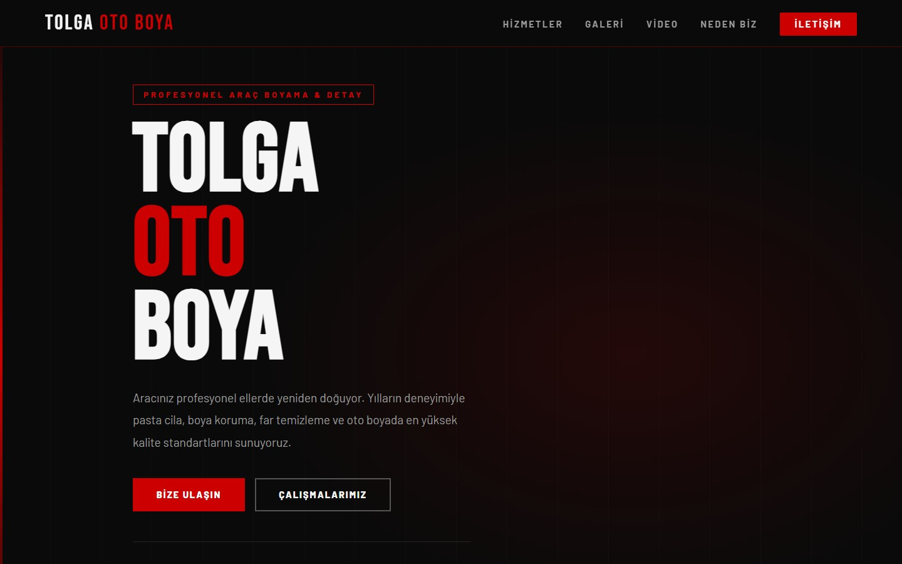

---

## 📋 İçindekiler

- [Proje Hakkında](#-proje-hakkında)
- [Uygulama Turu](#-uygulama-turu)
- [Mobil Görünüm](#-mobil-görünüm)
- [Özellikler](#-özellikler)
- [Teknolojiler](#️-teknolojiler)
- [Proje Yapısı](#-proje-yapısı)
- [Kurulum](#-kurulum)
- [Galeriye Yeni Fotoğraf Ekleme](#️-galeriye-yeni-fotoğraf-ekleme)
- [İletişim & Sosyal Medya](#-iletişim--sosyal-medya)
- [Geliştirici](#-geliştirici)

---

## 📌 Proje Hakkında

**Tolga Oto Boya**, 10+ yıllık deneyimiyle Aydın'da profesyonel araç boyama ve oto detay hizmetleri sunan bir atölyenin kurumsal tanıtım sitesidir. Site; sunulan hizmetleri, atölyede yapılmış gerçek işlerin fotoğraflarını, tanıtım videosunu ve doğrudan iletişim kanallarını tek sayfada bir araya getirir.

Herhangi bir framework veya build aracı **gerektirmez** — tamamen saf HTML, CSS ve JavaScript ile, tek bir `index.html` dosyasında geliştirilmiştir. Mobil, tablet ve masaüstü cihazlarda eksiksiz çalışır.

---

## 🧭 Uygulama Turu

Ziyaretçinin sayfayı yukarıdan aşağıya kaydırırken gördüğü bölümler:

### 1. Karşılama (Hero) — `#hero`

Sayfa açıldığında ziyaretçiyi büyük **TOLGA OTO BOYA** başlığı, kısa bir tanıtım metni ve iki eylem butonu karşılar: **Bize Ulaşın** doğrudan iletişim bölümüne, **Çalışmalarımız** galeriye kaydırır. Altında *500+ Mutlu Müşteri · 10+ Yıl Deneyim · %100 Memnuniyet* istatistikleri yer alır. Üstteki sabit menü, sayfa boyunca her bölüme tek tıkla ulaşmayı sağlar.

### 2. Tanıtım Videosu — `#video`

Atölyenin tanıtım videosu, sitenin kendi video oynatıcısıyla oynatılır (ek eklenti gerekmez). Yanında atölyenin öne çıkan dört vaadi listelenir.

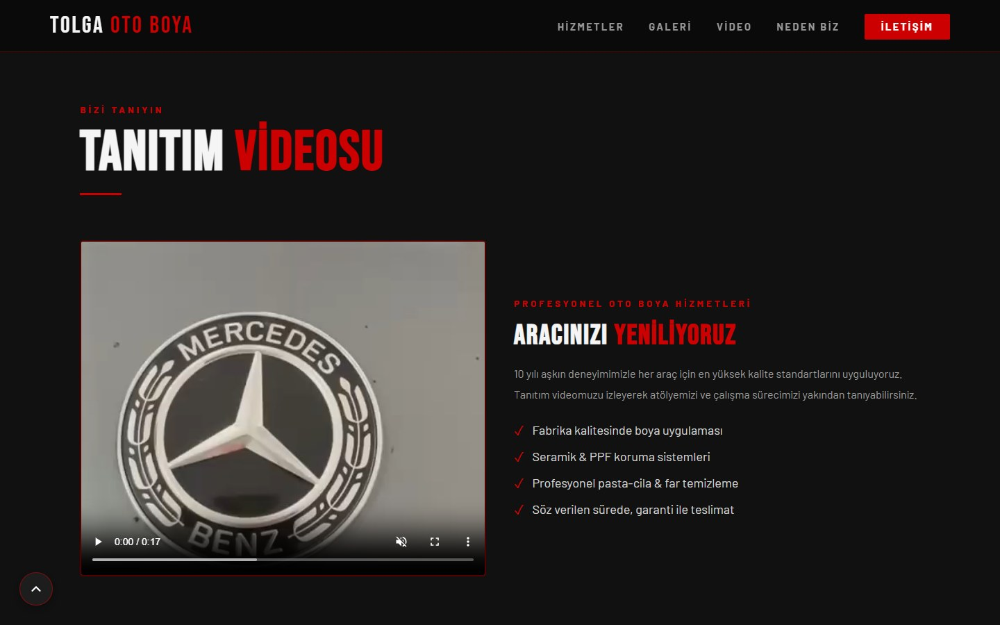

### 3. Hizmetlerimiz — `#hizmetler`

Atölyenin dört ana hizmeti kartlar halinde anlatılır. Her kart kısa bir açıklama ve o hizmetin kapsamındaki işlemleri içerir.

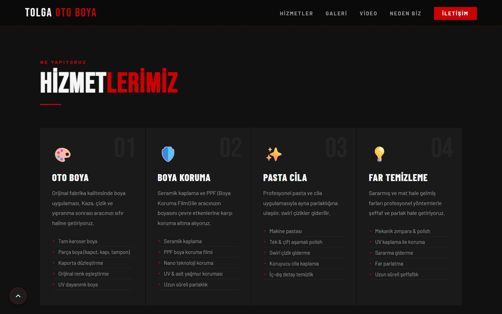

| # | Hizmet | Öne Çıkan Detaylar |
|---|--------|--------------------|
| 01 | **Oto Boya** | Tam karoser & parça boya, kaporta düzleştirme, orijinal renk eşleştirme, UV dayanımlı boya |
| 02 | **Boya Koruma** | Seramik kaplama, PPF (Boya Koruma Filmi), nano teknoloji koruma, UV & asit yağmur koruması |
| 03 | **Pasta Cila** | Makine pastası, tek & çift aşamalı polish, swirl çizik giderme, iç-dış detay temizlik |
| 04 | **Far Temizleme** | Mekanik zımpara & polish, UV kaplama ile koruma, sararma giderme, uzun süreli şeffaflık |

### 4. Çalışmalarımız (Galeri) — `#galeri`

Atölyede yapılmış gerçek işlerin fotoğrafları. Üstteki butonlarla galeri **hizmet türüne göre filtrelenir**: Tümü, Oto Boya, Pasta Cila, Boya Koruma, Far Temizleme.

| Tüm çalışmalar | "Far Temizleme" filtresi seçili |
|:---:|:---:|
| 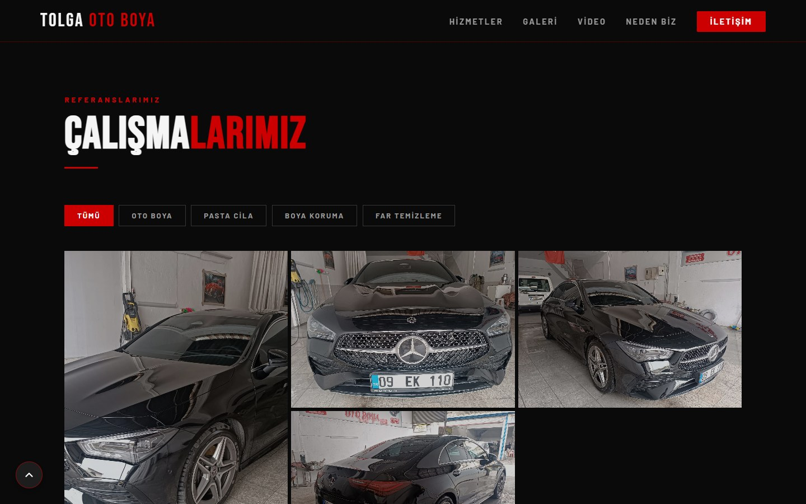 | 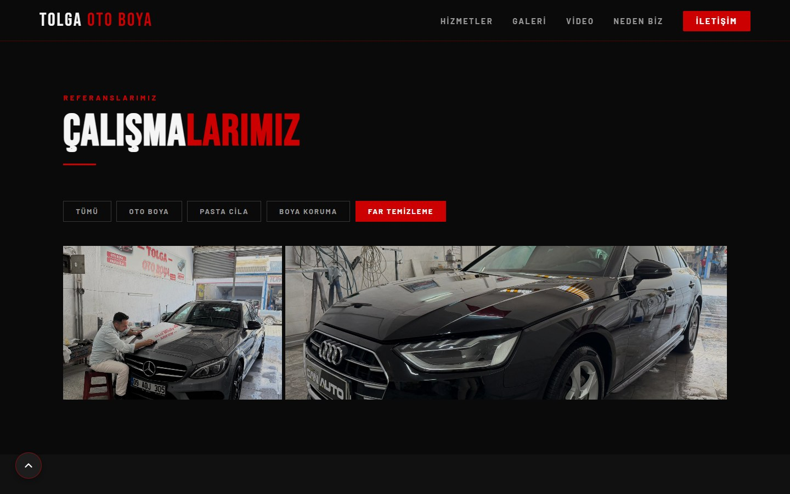 |

Bir fotoğrafa tıklandığında **tam ekran görüntüleyici (lightbox)** açılır. Burada:

- `←` / `→` butonları veya klavye ok tuşlarıyla fotoğraflar arasında geçiş yapılır (yalnızca seçili filtredeki fotoğraflar arasında),
- mobilde parmakla sağa/sola kaydırılır,
- `Esc` tuşu, `✕` butonu veya fotoğrafın dışına tıklama ile kapatılır.

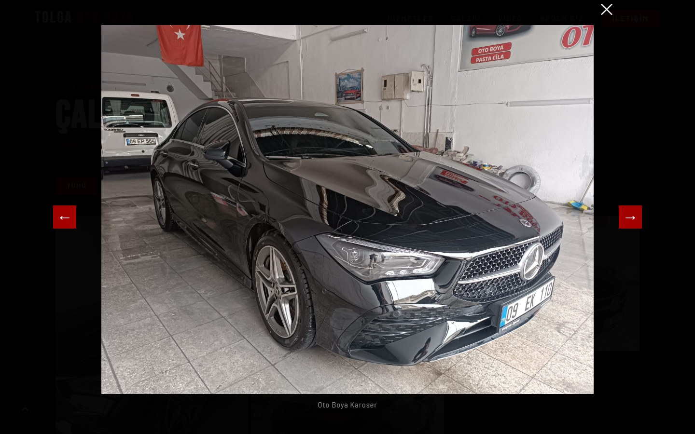

### 5. Neden Biz? — `#neden-biz`

Atölyeyi rakiplerinden ayıran altı özellik: deneyim, profesyonel ekipman, renk garantisi, hızlı teslimat, kalite güvencesi ve kolay ulaşılabilir konum.

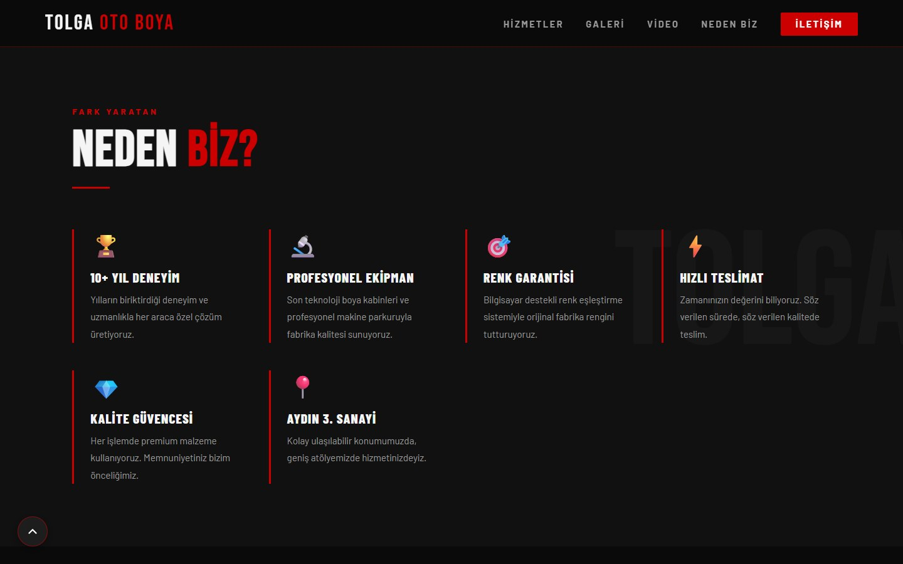

### 6. İletişim — `#iletisim`

Müşterinin atölyeye ulaşması için gereken her şey tek yerde:

- **Adres** kartı Google Maps'te yol tarifini açar,
- **Telefon** kartı mobilde doğrudan arama başlatır,
- **WhatsApp** kartı hazır bir mesajla ("Merhaba, Tolga Oto Boya hakkında bilgi almak istiyorum.") sohbet açar,
- çalışma saatleri, Instagram / WhatsApp butonları ve gömülü **Google Haritası** yer alır.

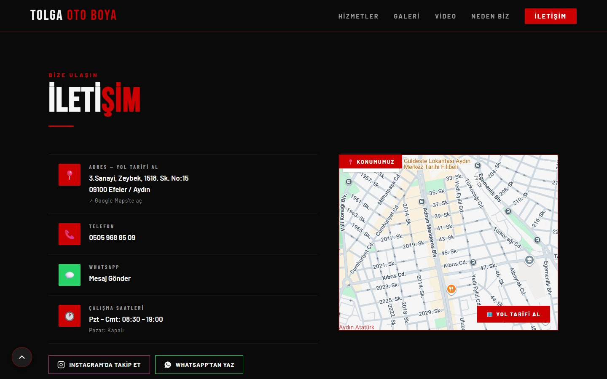

### 7. Alt Bilgi (Footer)

Logo, adres, sosyal medya kısayolları ve telif satırı (yıl otomatik güncellenir). Sayfa boyunca sağ altta sabit **Instagram** ve **WhatsApp** butonları, 400px kaydırmadan sonra sol altta **Yukarı Dön** butonu görünür.

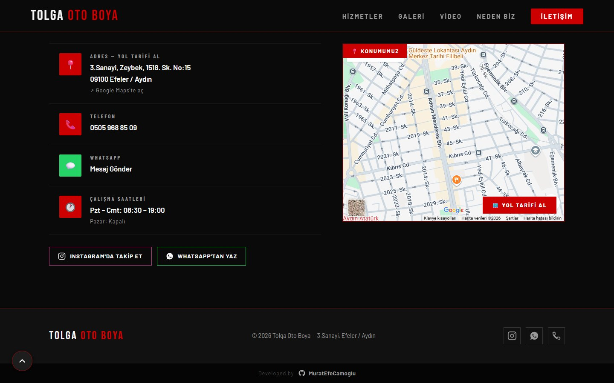

---

## 📱 Mobil Görünüm

Site telefon ekranlarına göre yeniden düzenlenir: üst menü **hamburger menüye** dönüşür, kartlar ve galeri tek sütuna iner.

| Ana sayfa | Açık menü | Galeri |
|:---:|:---:|:---:|
| 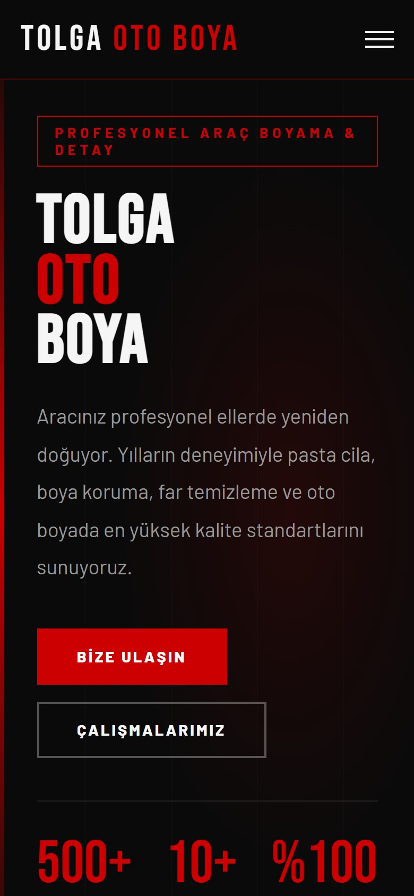 | 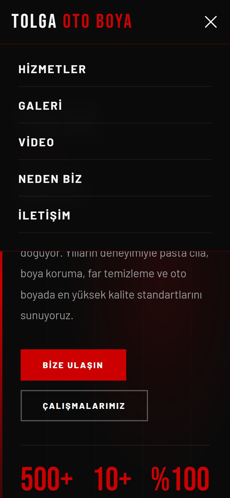 | 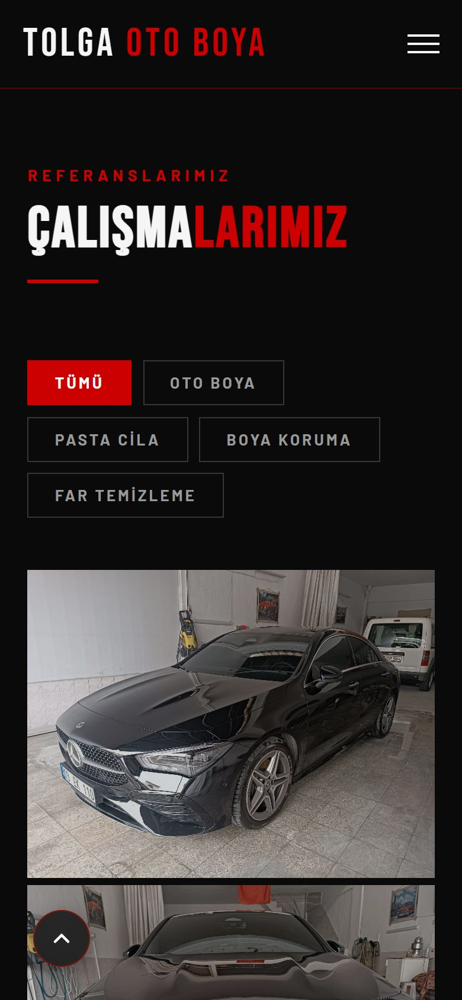 |

---

## ✨ Özellikler

| Özellik | Açıklama |
|---------|----------|
| 🌑 **Dark Tema** | Kırmızı (`#cc0000`) & siyah (`#0a0a0a`) kurumsal renk paleti |
| 📱 **Tam Responsive** | Mobil (≤600px), tablet (≤900px) ve masaüstü için CSS Grid & Flexbox |
| 🖼️ **Lightbox Galeri** | Kategori filtrelemeli, klavye & dokunmatik kaydırma destekli |
| 🎬 **Video Bölümü** | Atölye tanıtım videosu gömülü `<video>` oynatıcı ile |
| 🍔 **Hamburger Menü** | Mobil için animasyonlu açılır menü (`Esc` ile kapanır) |
| 👁️ **Scroll Reveal** | `IntersectionObserver` ile kaydırıldıkça beliren bölümler |
| ⬆️ **Yukarı Dön Butonu** | 400px kaydırma sonrası görünen, sol alt köşede sabit buton |
| 📍 **Google Maps** | Atölye konumu gömülü harita ile (Efeler/Aydın) |
| 💬 **WhatsApp Hızlı Mesaj** | Hazır mesaj metniyle doğrudan WhatsApp sohbeti açar |
| 📸 **Floating Instagram & WhatsApp** | Sağ alt köşede sabit sosyal medya butonları |
| ⌨️ **Klavye Erişilebilirliği** | Galeri öğeleri `Enter`/`Space` ile açılır; lightbox `Esc`, `←`, `→` destekler |

---

## 🛠️ Teknolojiler

| Teknoloji | Detay | Kullanım Amacı |
|-----------|-------|----------------|
| **HTML5** | Semantic — `<section>`, `<nav>`, `<footer>` | Sayfa yapısı, SEO, erişilebilirlik |
| **CSS3** | Vanilla CSS (Grid, Flexbox, Custom Properties) | Tüm stiller, animasyonlar, responsive |
| **JavaScript** | ES6+ | Galeri, lightbox, menü, reveal |
| **Google Fonts** | Bebas Neue · Barlow · Barlow Condensed | Başlık ve gövde tipografisi |
| **Google Maps Embed** | iframe | Konum haritası |
| **IntersectionObserver API** | Native browser API | Scroll reveal |
| **Touch Events API** | Native browser API | Lightbox'ta mobil kaydırma (swipe) |

---

## 📁 Proje Yapısı

```
TolgaOtoBoya-Website/
│
├── index.html              # Ana sayfa — tüm HTML yapısı + inline CSS + JS
│
├── images/                 # Galeri ve ek görseller (.jpeg)
├── videos/                 # Atölye tanıtım videoları
│   ├── tanitim-video-1.mp4 # Yedek kaynak
│   └── tanitim-video-2.mp4 # Ana kaynak (öncelikli)
│
├── docs/screenshots/       # README'deki ekran görüntüleri
└── tolga oto boya.txt      # Proje istek notları
```

---

## 🚀 Kurulum

Herhangi bir bağımlılık kurulumu veya build adımı **gerekmez**.

```bash
# 1. Depoyu klonlayın
git clone https://github.com/MuratEfeCamoglu/TolgaOtoBoya-Website.git

# 2. Proje klasörüne girin
cd TolgaOtoBoya-Website

# 3. index.html'i doğrudan tarayıcıda açın
#    — ya da VS Code Live Server eklentisi ile çalıştırın (önerilir, port 5501)
```

---

## 🖼️ Galeriye Yeni Fotoğraf Ekleme

1. Fotoğrafı `images/` klasörüne kopyalayın (örn. `images/galeri-25.jpeg`).
2. `index.html` içinde `<div class="gallery-grid">` bloğuna mevcut bir öğeyi kopyalayıp düzenleyin:

```html
<div class="gallery-item reveal" data-category="pasta-cila" onclick="openLightboxSrc(this)">
  
  <div class="gallery-overlay">
    <div><span class="gallery-tag">Pasta Cila</span>
      <div class="gallery-label">Pasta Cila — Sonrası</div>
    </div>
  </div>
  <div class="gallery-zoom">🔍</div>
</div>
```

- `data-category` filtre butonunu belirler: `oto-boya`, `pasta-cila`, `boya-koruma` veya `far-temizleme`.
- `alt` metni lightbox'ta fotoğrafın altında başlık olarak görünür.
- Kartı büyütmek için sınıfa `tall` (iki satır yüksek) veya `wide` (iki sütun geniş) ekleyebilirsiniz.

---

## 📞 İletişim & Sosyal Medya

| Kanal | Bilgi / Link |
|-------|-------------|
| 📍 **Adres** | [3.Sanayi, Zeybek, 1518. Sk. No:15, 09100 Efeler / Aydın](https://maps.google.com/?q=3.+Sanayi+Zeybek+1518.+Sk.+No:15+Efeler+Aydin) |
| 📞 **Telefon** | [0505 968 85 09](tel:+905059688509) |
| 💬 **WhatsApp** | [Mesaj Gönder](https://wa.me/905059688509?text=Merhaba%2C%20Tolga%20Oto%20Boya%20hakk%C4%B1nda%20bilgi%20almak%20istiyorum.) |
| 📸 **Instagram** | [@tolga.camoglu](https://www.instagram.com/tolga.camoglu) |
| 🕐 **Çalışma Saatleri** | Pzt – Cmt: 08:30 – 19:00 · Pazar: Kapalı |

---

## 👨‍💻 Geliştirici

Bu proje **[MuratEfeCamoglu](https://github.com/MuratEfeCamoglu)** tarafından geliştirilmiştir.

---

## 📄 Lisans

Bu proje özel kullanım amaçlıdır. Tüm hakları saklıdır © 2026 Tolga Oto Boya — Efeler / Aydın.
